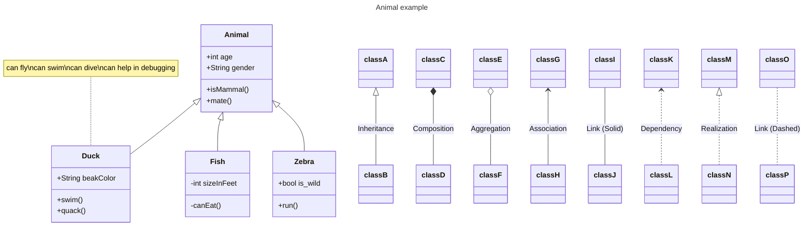

```mermaid
---
title: Animal example
---
classDiagram

    note for Duck "can fly\ncan swim\ncan dive\ncan help in debugging"

    Animal <|-- Duck
    Animal <|-- Fish
    Animal <|-- Zebra


    class Animal {
        +int age
        +String gender
        +isMammal()
        +mate()
    }

    class Duck{
        +String beakColor
        +swim()
        +quack()
    }

    class Fish{
        -int sizeInFeet
        -canEat()
    }

    class Zebra{
        +bool is_wild
        +run()
    }

    classA <|-- classB : Inheritance
    classC *-- classD : Composition
    classE o-- classF : Aggregation
    classG <-- classH : Association
    classI -- classJ : Link (Solid)
    classK <.. classL : Dependency
    classM <|.. classN : Realization
    classO .. classP : Link (Dashed)

```