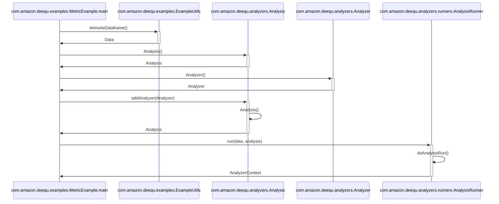

```mermaid
sequenceDiagram
    participant main as com.amazon.deequ.examples.MetricExample.main
    participant ExampleUtils as com.amazon.deequ.examples.ExampleUtils
    participant Analysis as com.amazon.deequ.analyzers.Analysis
    participant Analyzer as com.amazon.deequ.analyzers.Analyzer

    participant AnalysisRunner as com.amazon.deequ.analyzers.runners.AnalysisRunner

    main ->>+ ExampleUtils: itemsAsDataframe()
    ExampleUtils ->>- main: Data

    main ->>+ Analysis: Analysis()
    Analysis ->>- main: Analysis
    main ->>+ Analyzer: Analyzer()
    Analyzer ->>- main: Analyzer

    main ->>+ Analysis: addAnalyzer(Analyzer)
    Analysis ->> Analysis: Analysis()
    Analysis ->>- main: Analysis

    main ->>+ AnalysisRunner: run(data, analysis)

    AnalysisRunner ->> AnalysisRunner: doAnalysisRun()

    AnalysisRunner ->>- main: AnalyzerContext
```