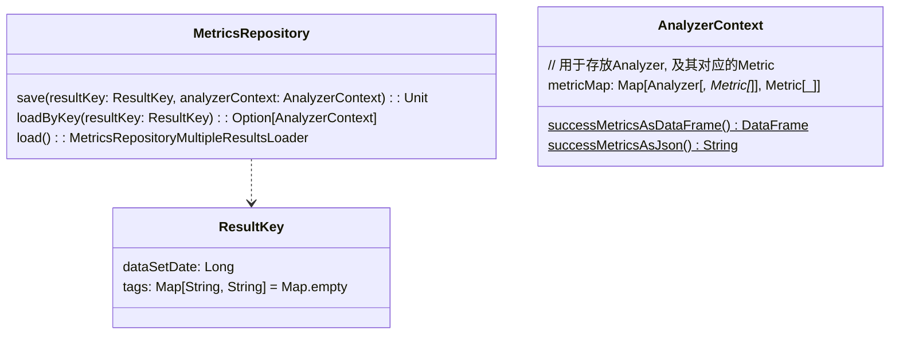

```mermaid
classDiagram
    class MetricsRepository {
        save(resultKey: ResultKey, analyzerContext: AnalyzerContext): Unit
        loadByKey(resultKey: ResultKey): Option[AnalyzerContext]
        load(): MetricsRepositoryMultipleResultsLoader
    }

    class ResultKey {
        dataSetDate: Long
        tags: Map[String, String] = Map.empty
    }

    class AnalyzerContext {
        // 用于存放Analyzer, 及其对应的Metric
        metricMap: Map[Analyzer[_, Metric[_]], Metric[_]]
        successMetricsAsDataFrame() DataFrame$
        successMetricsAsJson() String$
    }


    MetricsRepository ..> ResultKey
```