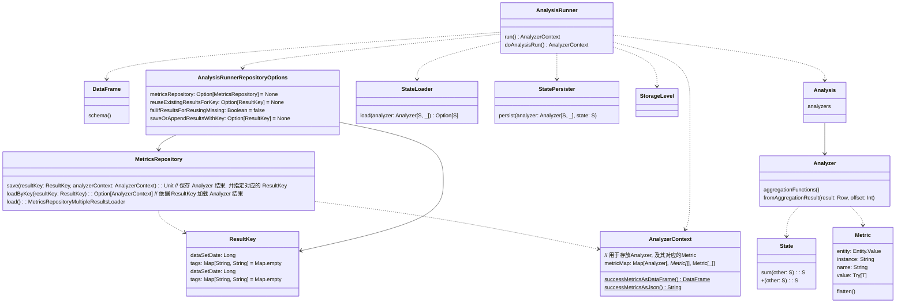

```mermaid
classDiagram
    class DataFrame {
        schema()
    }
    class Analysis {
        analyzers
    }
    class Analyzer {
        aggregationFunctions()
        fromAggregationResult(result: Row, offset: Int)
    }
    class State {
        sum(other: S): S
        +(other: S): S
    }
    class Metric {
        entity: Entity.Value
        instance: String
        name: String
        value: Try[T]
        flatten()
    }
    class AnalysisRunner {
        run() AnalyzerContext
        doAnalysisRun() AnalyzerContext
    }
    class AnalyzerContext {
        // 用于存放Analyzer, 及其对应的Metric
        metricMap: Map[Analyzer[_, Metric[_]], Metric[_]]
        successMetricsAsDataFrame() DataFrame$
        successMetricsAsJson() String$
    }

    class StateLoader {
        load(analyzer: Analyzer[S, _]) Option[S]
    }
    class StatePersister {
        persist(analyzer: Analyzer[S, _], state: S)
    }
    class StorageLevel

    class AnalysisRunnerRepositoryOptions {
      metricsRepository: Option[MetricsRepository] = None
      reuseExistingResultsForKey: Option[ResultKey] = None
      failIfResultsForReusingMissing: Boolean = false
      saveOrAppendResultsWithKey: Option[ResultKey] = None
    }
    class MetricsRepository {
        save(resultKey: ResultKey, analyzerContext: AnalyzerContext): Unit // 保存 Analyzer 结果, 并指定对应的 ResultKey
        loadByKey(resultKey: ResultKey): Option[AnalyzerContext] // 依据 ResultKey 加载 Analyzer 结果
        load(): MetricsRepositoryMultipleResultsLoader
    }

    class ResultKey {
        dataSetDate: Long
        tags: Map[String, String] = Map.empty
    }
    class ResultKey {
        dataSetDate: Long
        tags: Map[String, String] = Map.empty
    }

    MetricsRepository ..> ResultKey
    MetricsRepository ..> AnalyzerContext

    Analyzer ..> State
    Analyzer ..> Metric

    Analysis --> Analyzer

    AnalysisRunner ..> AnalysisRunnerRepositoryOptions
    AnalysisRunner ..> Analysis
    AnalysisRunner ..> DataFrame
    AnalysisRunner ..> AnalyzerContext
    AnalysisRunner ..> StateLoader
    AnalysisRunner ..> StatePersister
    AnalysisRunner ..> StorageLevel

    AnalysisRunnerRepositoryOptions --> MetricsRepository
    AnalysisRunnerRepositoryOptions --> ResultKey

```

